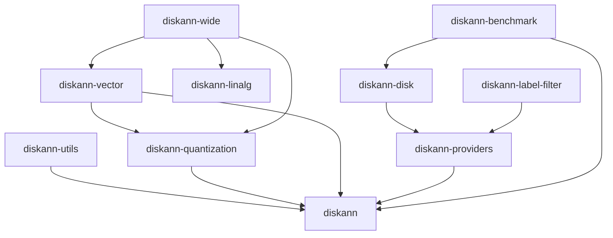

# DiskANN 软件架构分析文档 (4+1 视图)

**版本**: v0.49.1 (Rust 重构版)  
**分析日期**: 2026-03-27  
**仓库**: https://github.com/microsoft/DiskANN

---

## 1. 概述

DiskANN 是微软开发的大规模近似最近邻搜索 (ANN) 系统，支持十亿级向量的高效检索。当前版本已完成从 C++ 到 Rust 的重构，采用模块化 Workspace 架构。

### 核心特性
- **图索引算法**: 基于 NSG (Navigating Spreading-out Graph) 的 Vamana 算法
- **混合存储**: 内存 + 磁盘两级索引
- **量化支持**: 标量量化 (SQ)、乘积量化 (PQ)、二值量化
- **实时更新**: 支持动态插入、删除、合并
- **标签过滤**: 基于倒排索引的过滤搜索

---

## 2. 逻辑视图 (Logical View)

### 2.1 分层架构

```
┌─────────────────────────────────────────────────────────────────┐
│                    Application Layer                             │
│  ┌─────────────┐  ┌─────────────┐  ┌─────────────────────────┐  │
│  │ diskann-    │  │ diskann-    │  │ vectorset (CLI)         │  │
│  │ benchmark   │  │ tools       │  │                         │  │
│  └─────────────┘  └─────────────┘  └─────────────────────────┘  │
├─────────────────────────────────────────────────────────────────┤
│                    Algorithm Layer                               │
│  ┌─────────────────────────────────────────────────────────────┐│
│  │                    diskann (Core)                           ││
│  │  ┌──────────┐ ┌──────────┐ ┌──────────┐ ┌───────────────┐  ││
│  │  │ Index    │ │ Search   │ │ Graph    │ │ Neighbor      │  ││
│  │  │ (Vamana) │ │ (KNN/    │ │ (AdjList)│ │ (PriorityQ)   │  ││
│  │  │          │ │  Range)  │ │          │ │               │  ││
│  │  └──────────┘ └──────────┘ └──────────┘ └───────────────┘  ││
│  └─────────────────────────────────────────────────────────────┘│
├─────────────────────────────────────────────────────────────────┤
│                    Provider Layer                                │
│  ┌─────────────┐  ┌─────────────┐  ┌─────────────────────────┐  │
│  │ diskann-    │  │ diskann-    │  │ diskann-label-filter    │  │
│  │ providers   │  │ disk        │  │                         │  │
│  │ (Storage)   │  │ (io_uring)  │  │ (Inverted Index)        │  │
│  └─────────────┘  └─────────────┘  └─────────────────────────┘  │
├─────────────────────────────────────────────────────────────────┤
│                    Foundation Layer                              │
│  ┌──────────┐ ┌──────────┐ ┌──────────┐ ┌──────────┐ ┌───────┐ │
│  │ diskann- │ │ diskann- │ │ diskann- │ │ diskann- │ │diskann│ │
│  │ vector   │ │ linalg   │ │ quantize │ │ wide     │ │ utils │ │
│  │ (SIMD)   │ │ (BLAS)   │ │ (PQ/SQ)  │ │ (SIMD)   │ │       │ │
│  └──────────┘ └──────────┘ └──────────┘ └──────────┘ └───────┘ │
└─────────────────────────────────────────────────────────────────┘
```

### 2.2 核心模块职责

| 模块 | 职责 | 关键类型 |
|------|------|----------|
| `diskann` | 核心索引算法、图构建、搜索 | `DiskANNIndex`, `Config`, `Search` |
| `diskann-vector` | 向量操作、距离函数、SIMD | `DistanceFunction`, `MathematicalValue` |
| `diskann-linalg` | 线性代数 (SGEMM, SVD) | `sgemm()`, `svd_into()` |
| `diskann-quantization` | 向量压缩、量化距离 | `ScalarQuantizer`, `ProductQuantizer` |
| `diskann-providers` | 存储抽象层 | `DataProvider`, `NeighborAccessor` |
| `diskann-disk` | 磁盘索引、io_uring | `DiskIndexBuildParameters` |
| `diskann-label-filter` | 标签过滤、倒排索引 | `InvertedIndexProvider`, `ASTExpr` |
| `diskann-wide` | 底层 SIMD 抽象 | `BitSlice`, 宽度类型 |

---

## 3. 进程视图 (Process View)

### 3.1 运行时架构

```
┌────────────────────────────────────────────────────────────────┐
│                        Client Request                           │
└──────────────────────────┬─────────────────────────────────────┘
                           │
                           ▼
┌────────────────────────────────────────────────────────────────┐
│                    Tokio Async Runtime                          │
│  ┌──────────────┐  ┌──────────────┐  ┌──────────────┐          │
│  │ Search Task  │  │ Insert Task  │  │ Build Task   │          │
│  │ (async)      │  │ (async)      │  │ (rayon)      │          │
│  └──────┬───────┘  └──────┬───────┘  └──────┬───────┘          │
│         │                 │                 │                   │
│         ▼                 ▼                 ▼                   │
│  ┌─────────────────────────────────────────────────────────┐   │
│  │              ObjectPool<SearchScratch>                   │   │
│  │         (线程安全的 Scratch 空间池)                       │   │
│  └─────────────────────────────────────────────────────────┘   │
└────────────────────────────────────────────────────────────────┘
                           │
                           ▼
┌────────────────────────────────────────────────────────────────┐
│                    DiskANNIndex<DP>                             │
│  ┌────────────────┐  ┌────────────────┐  ┌────────────────┐    │
│  │ Graph Layer    │  │ Data Provider  │  │ Scratch Pool   │    │
│  │ (AdjacencyList)│  │ (Vectors)      │  │ (Search State) │    │
│  └────────────────┘  └────────────────┘  └────────────────┘    │
└────────────────────────────────────────────────────────────────┘
                           │
         ┌─────────────────┼─────────────────┐
         ▼                 ▼                 ▼
┌─────────────┐   ┌─────────────┐   ┌─────────────┐
│ Memory      │   │ Disk        │   │ Label       │
│ Storage     │   │ Storage     │   │ Index       │
│ (RAM)       │   │ (io_uring)  │   │ (Roaring)   │
└─────────────┘   └─────────────┘   └─────────────┘
```

### 3.2 并发模型

```rust
// 并行策略枚举
pub enum Parallelism {
    Sequential,     // 单线程
    #[cfg(feature = "rayon")]
    Rayon,          // Rayon 线程池
}

// 搜索状态 (支持分页)
pub struct SearchState<VectorIdType, ExtraState> {
    scratch: SearchScratch<VectorIdType>,  // 每线程独立
    computed_result: Vec<Neighbor<VectorIdType>>,
    next_result_index: usize,
    search_param_l: usize,
    extra: ExtraState,
}
```

---

## 4. 开发视图 (Development View)

### 4.1 Workspace 结构

```
diskann/
├── Cargo.toml                 # Workspace 配置
├── rust-toolchain.toml        # Rust 版本固定
│
├── diskann/                   # 🔵 核心算法 Crate
│   ├── src/
│   │   ├── graph/             # 图索引实现
│   │   │   ├── index.rs       # DiskANNIndex (2700+ 行)
│   │   │   ├── adjacencylist.rs
│   │   │   ├── search/        # 搜索策略
│   │   │   │   ├── knn_search.rs
│   │   │   │   ├── range_search.rs
│   │   │   │   └── diverse_search.rs
│   │   │   └── glue/          # 策略模式
│   │   ├── provider.rs        # DataProvider trait
│   │   └── neighbor/          # 邻居队列
│   └── Cargo.toml
│
├── diskann-providers/         # 🟢 存储抽象层
│   ├── src/
│   │   ├── index/             # 索引存储
│   │   │   ├── diskann_async.rs  # 异步索引 (158KB!)
│   │   │   └── index_storage.rs
│   │   ├── storage/           # 存储后端
│   │   │   ├── pq_storage.rs  # PQ 向量存储
│   │   │   ├── sq_storage.rs  # SQ 向量存储
│   │   │   └── bin.rs         # 二值存储
│   │   └── model/             # 数据模型
│   └── Cargo.toml
│
├── diskann-disk/              # 🟡 磁盘索引
│   ├── src/
│   │   ├── build/             # 构建器
│   │   ├── search/            # 磁盘搜索
│   │   └── storage/           # 磁盘存储
│   └── Cargo.toml
│
├── diskann-quantization/      # 🔴 量化模块
│   ├── src/
│   │   ├── scalar/            # 标量量化
│   │   ├── product/           # 乘积量化
│   │   ├── binary/            # 二值量化
│   │   ├── spherical/         # 球面量化 (RabitQ)
│   │   └── minmax/            # MinMax 量化
│   └── Cargo.toml
│
├── diskann-label-filter/      # 🟣 标签过滤
│   ├── src/
│   │   ├── parser/            # 查询解析器
│   │   ├── kv_index/          # KV 索引
│   │   └── encoded_attribute_provider/
│   └── Cargo.toml
│
├── diskann-vector/            # 🟠 向量操作
│   ├── src/
│   │   ├── distance/          # 距离函数
│   │   ├── norm/              # 范数计算
│   │   └── contains/          # SIMD contains
│   └── Cargo.toml
│
├── diskann-linalg/            # 🟤 线性代数
│   ├── src/
│   │   └── faer/              # 基于 faer 的实现
│   └── Cargo.toml
│
├── diskann-wide/              # ⚪ SIMD 基础
│   ├── src/
│   │   ├── arch/              # 架构特定实现
│   │   └── traits.rs          # 宽度类型 trait
│   └── Cargo.toml
│
└── diskann-benchmark/         # 🔧 基准测试
    └── ...
```

### 4.2 依赖关系图



---

## 5. 物理视图 (Physical View)

### 5.1 部署架构

```
┌─────────────────────────────────────────────────────────────────┐
│                        Single Node                               │
│  ┌───────────────────────────────────────────────────────────┐  │
│  │                        RAM                                 │  │
│  │  ┌─────────────────┐  ┌─────────────────────────────────┐ │  │
│  │  │ In-Memory Index │  │ Compressed Vectors (PQ/SQ)      │ │  │
│  │  │ (Graph + ID Map)│  │ Cache-friendly Layout           │ │  │
│  │  └─────────────────┘  └─────────────────────────────────┘ │  │
│  └───────────────────────────────────────────────────────────┘  │
│                              │                                   │
│                              ▼                                   │
│  ┌───────────────────────────────────────────────────────────┐  │
│  │                    SSD / NVMe                              │  │
│  │  ┌─────────────────┐  ┌─────────────────────────────────┐ │  │
│  │  │ Disk Index      │  │ Full-Precision Vectors          │ │  │
│  │  │ (Chunked Graph) │  │ Memory-Mapped Access            │ │  │
│  │  └─────────────────┘  └─────────────────────────────────┘ │  │
│  └───────────────────────────────────────────────────────────┘  │
│                              │                                   │
│                              ▼                                   │
│  ┌───────────────────────────────────────────────────────────┐  │
│  │                    Linux Kernel                           │  │
│  │  ┌─────────────────────────────────────────────────────┐  │  │
│  │  │ io_uring (Async I/O)                                │  │  │
│  │  │ - 批量 I/O 提交                                     │  │  │
│  │  │ - 零拷贝数据传输                                    │  │  │
│  │  └─────────────────────────────────────────────────────┘  │  │
│  └───────────────────────────────────────────────────────────┘  │
└─────────────────────────────────────────────────────────────────┘
```

### 5.2 数据布局

```
内存中:
┌────────────────────────────────────────────────────┐
│ Graph Metadata                                      │
│ ├── Config (R, L, max_degree)                      │
│ ├── Start Points                                   │
│ └── Statistics                                     │
├────────────────────────────────────────────────────┤
│ Adjacency Lists (紧凑存储)                          │
│ ├── Node 0: [neighbor_ids...]                      │
│ ├── Node 1: [neighbor_ids...]                      │
│ └── ...                                            │
├────────────────────────────────────────────────────┤
│ Compressed Vectors (可选)                           │
│ ├── PQ Codes (uint8[])                             │
│ ├── SQ Codes + Compensation                        │
│ └── Binary Codes (bit-packed)                     │
└────────────────────────────────────────────────────┘

磁盘上:
┌────────────────────────────────────────────────────┐
│ Disk Index File                                     │
│ ├── Header (metadata, statistics)                  │
│ ├── Chunked Graph (分块邻接表)                      │
│ ├── Sector-aligned Data                            │
│ └── Full-precision Vectors                         │
└────────────────────────────────────────────────────┘
```

---

## 6. 场景视图 (Use Case View)

### 6.1 核心用例

#### UC-1: 向量搜索 (KNN Search)

```
Actor: Client Application
Goal: 查找与查询向量最相似的 K 个向量

Main Flow:
1. Client 调用 index.search(query, k, config)
2. 系统从起点开始贪心图遍历
3. 使用优先队列维护候选集
4. 返回 Top-K 结果

Code Path:
DiskANNIndex::search()
  → SearchStrategy::search()
    → Knn::search()
      → graph_traversal()
        → distance_computation()
```

#### UC-2: 向量插入

```
Actor: Client Application
Goal: 将新向量插入索引

Main Flow:
1. Client 调用 index.insert(id, vector)
2. 系统搜索最近邻作为连接点
3. 修剪边以保持图质量
4. 更新邻接表

Code Path:
DiskANNIndex::insert()
  → InsertStrategy::insert()
    → search_for_neighbors()
    → prune_edges()
    → update_adjacency_lists()
```

#### UC-3: 标签过滤搜索

```
Actor: Client Application  
Goal: 在特定标签子集中搜索

Main Flow:
1. Client 提供查询向量 + 过滤表达式
2. 解析过滤表达式为 AST
3. 使用倒排索引过滤候选节点
4. 在过滤后的子图中搜索

Code Path:
DiskANNIndex::search()
  → FilteredSearchStrategy
    → QueryLabelProvider::is_match()
      → InvertedIndexProvider
```

#### UC-4: 磁盘索引构建

```
Actor: System Administrator
Goal: 为大规模数据构建磁盘索引

Main Flow:
1. 加载数据分块
2. 内存中构建子图
3. 合并子图为全局图
4. 优化图布局用于磁盘访问
5. 序列化到磁盘

Code Path:
DiskIndexBuilder::build()
  → chunk_data()
  → build_memory_subgraphs()
  → merge_graphs()
  → optimize_for_disk_layout()
  → serialize()
```

---

## 7. 潜在优化点分析

### 7.1 🔴 高优先级优化

#### 7.1.1 SIMD 距离计算优化

**现状**: `diskann-vector` 和 `diskann-wide` 已有 SIMD 实现，但仅支持 x86_64 AVX2

```rust
// diskann-vector/src/lib.rs
cfg_if::cfg_if! {
    if #[cfg(all(target_arch = "x86_64", target_feature = "avx2"))] {
        // 仅 x86_64 有 prefetch 实现
    } else {
        pub fn prefetch_hint_max<const N: usize, T>(_vec: &[T] {}  // 空实现
    }
}
```

**优化建议**:
1. **ARM NEON 支持**: 添加 `target_arch = "aarch64"` 分支
2. **AVX-512 支持**: 利用更宽的 SIMD 寄存器
3. **距离计算批量化**: 批量计算多个向量距离

```rust
// 建议的优化接口
pub trait BatchDistanceFunction {
    fn compute_batch(
        &self,
        query: &[f32],
        candidates: &[&[f32]],
        results: &mut [f32]
    );
}
```

#### 7.1.2 内存访问模式优化

**现状**: 邻接表存储分散，缓存不友好

**优化建议**:
1. **CSR 格式邻接表**: 压缩稀疏行格式，提高缓存利用率
2. **图重排序**: 按 BFS/DFS 顺序重排节点 ID
3. **预取优化**: 在遍历时预取下一层邻居

```rust
// 建议的 CSR 邻接表
pub struct CSRAdjacencyList {
    offsets: Vec<usize>,      // 节点偏移
    neighbors: Vec<u32>,      // 紧凑邻居数组
    // 缓存行对齐
    _padding: [u8; 64 - std::mem::size_of::<usize>() % 64],
}
```

### 7.2 🟡 中优先级优化

#### 7.2.1 量化压缩率提升

**现状**: 支持多种量化，但压缩率与精度权衡可调

**优化建议**:
1. **自适应量化**: 根据向量分布选择最佳量化方式
2. **分层量化**: 不同层级使用不同精度
3. **OPQ (Optimized PQ)**: 旋转向量空间再量化

#### 7.2.2 并行搜索优化

**现状**: 支持 Rayon 并行，但搜索策略是单线程

**优化建议**:
1. **Beam Search 并行化**: 多路径并行探索
2. **分片索引**: 按向量空间分片，并行搜索
3. **异步 I/O 重叠**: 计算与 I/O 流水线化

```rust
// 建议的并行搜索策略
pub struct ParallelBeamSearch {
    num_beams: usize,
    beam_width: usize,
}

impl SearchStrategy for ParallelBeamSearch {
    fn search(&self, ...) {
        self.beams.par_iter_mut()
            .for_each(|beam| beam.traverse());
    }
}
```

#### 7.2.3 磁盘 I/O 优化

**现状**: 已使用 io_uring，但可进一步优化

**优化建议**:
1. **智能预取**: 基于搜索路径预测预取
2. **批量 I/O**: 合并多个小请求
3. **直接 I/O**: 绕过页缓存，减少拷贝

### 7.3 🟢 低优先级优化

#### 7.3.1 构建加速

**优化建议**:
1. **增量构建**: 新数据增量添加而非重建
2. **采样优化**: 更智能的起点选择
3. **并行修剪**: 多线程边修剪

#### 7.3.2 内存占用优化

**优化建议**:
1. **邻居 ID 压缩**: 使用变长编码
2. **图结构压缩**: 差分编码 + 位打包
3. **内存池**: 统一分配减少碎片

---

## 8. 性能关键路径

### 8.1 搜索路径分析

```
search() 
  │
  ├─> get_search_scratch()      ~100ns (pool access)
  │
  ├─> [LOOP] graph traversal
  │     │
  │     ├─> prefetch_neighbors()  ~50ns (SIMD prefetch)
  │     │
  │     ├─> [LOOP] neighbors
  │     │     │
  │     │     ├─> check_visited()   ~10ns (hash/bitmap)
  │     │     │
  │     │     ├─> distance()        ~100-500ns (SIMD)
  │     │     │
  │     │     └─> push_queue()      ~50ns
  │     │
  │     └─> pop_queue()           ~50ns
  │
  └─> return results            ~100ns
```

**关键瓶颈**:
1. 距离计算 (~60% 时间) - SIMD 优化重点
2. 缓存未命中 (~20% 时间) - 内存布局优化重点
3. 优先队列操作 (~10% 时间) - 数据结构优化

---

## 9. 总结

### 架构优势
- ✅ **模块化设计**: 15+ Crates 清晰分层
- ✅ **Rust 安全性**: 内存安全、无数据竞争
- ✅ **异步友好**: Tokio + io_uring
- ✅ **量化灵活**: 多种量化策略可选
- ✅ **可扩展**: Provider trait 抽象

### 待改进点
- ⚠️ **ARM 支持不足**: SIMD 仅支持 x86
- ⚠️ **图布局**: 邻接表缓存效率可提升
- ⚠️ **并行搜索**: 单搜索路径串行
- ⚠️ **内存开销**: 索引结构可压缩

### 推荐优化顺序
1. **SIMD 多架构支持** (收益最大)
2. **CSR 邻接表 + 图重排序** (缓存友好)
3. **并行 Beam Search** (延迟优化)
4. **智能 I/O 预取** (磁盘索引)

---

*文档生成于 2026-03-27*
